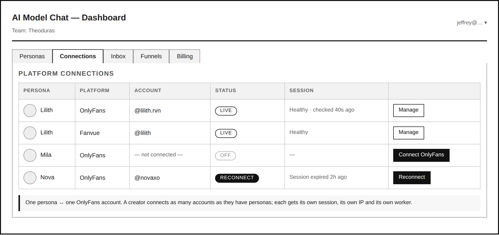
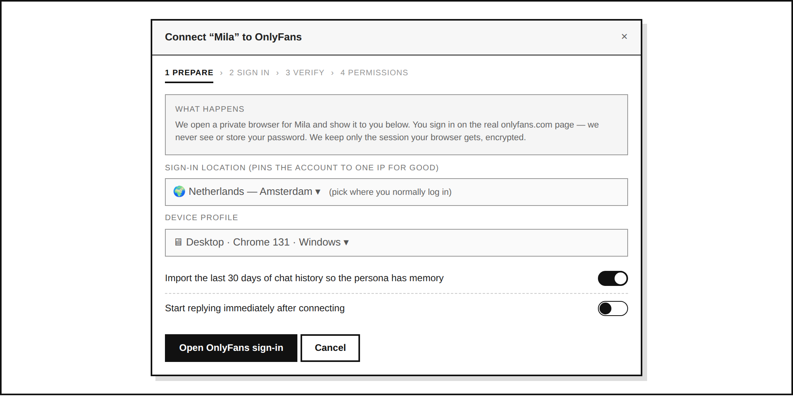
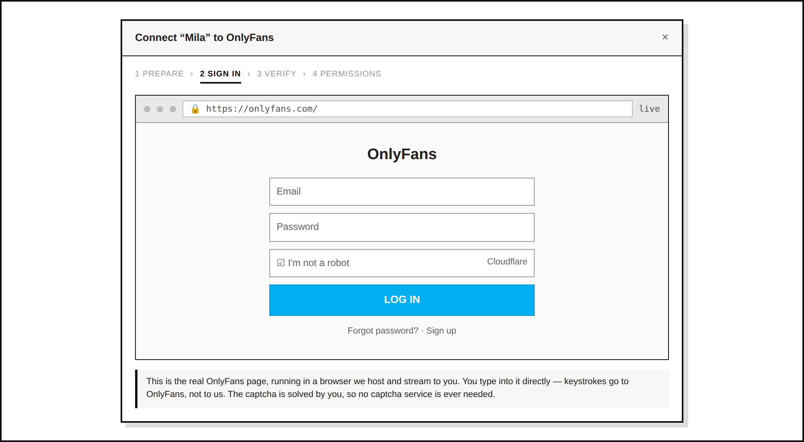
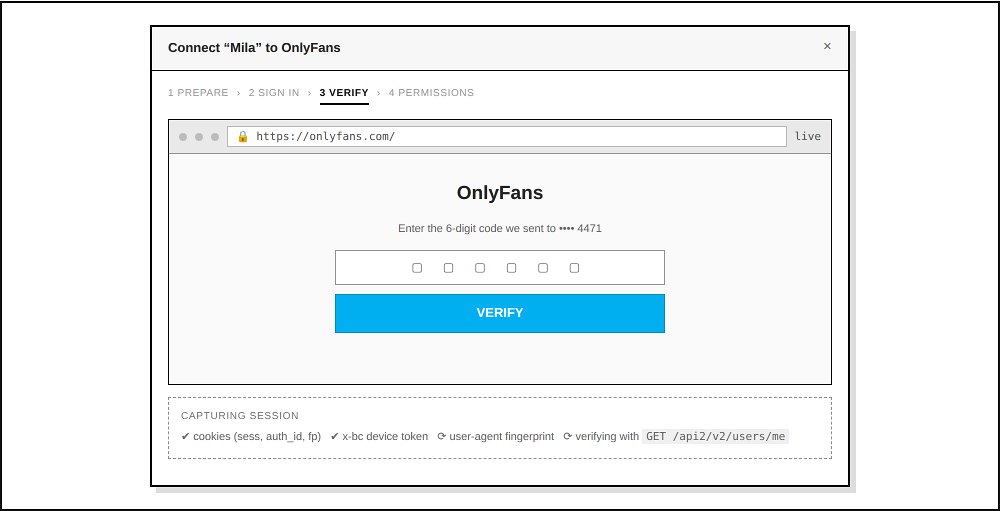
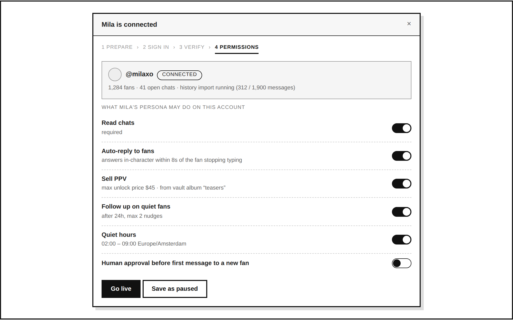
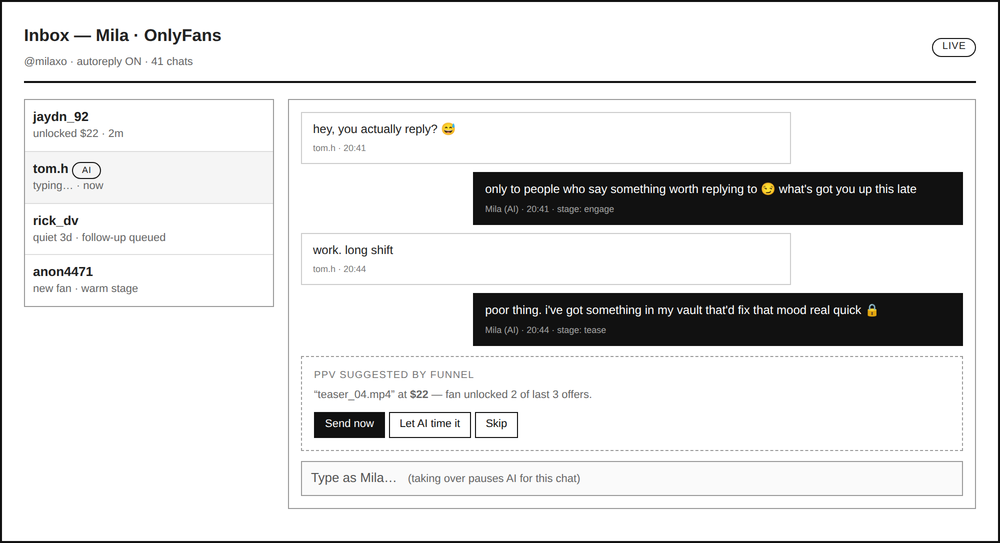
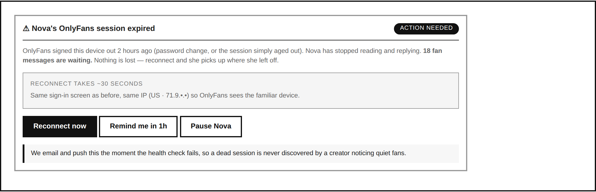
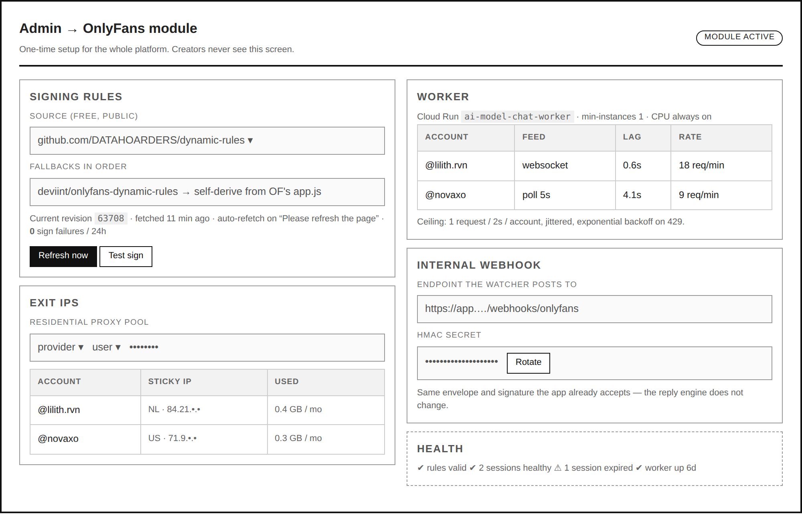
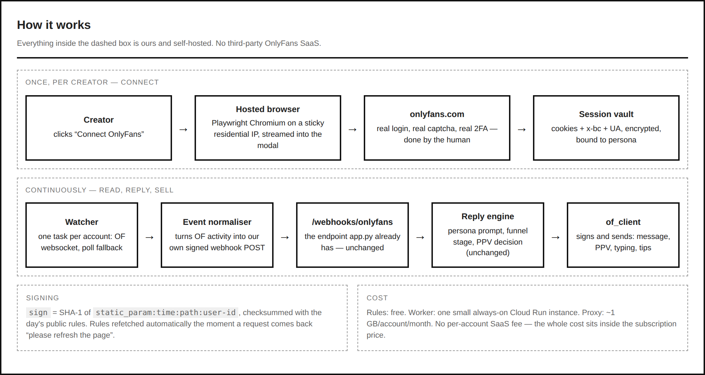

# Self-hosted OnlyFans connection

Replace the paid OnlyFansAPI.com dependency with our own connection layer, so a
creator connects each persona to an OnlyFans account by signing in the way they
sign in to onlyfans.com — and we pay per server, not per account.

---

## 1. The problem, stated plainly

OnlyFans has no public API and no outbound webhooks. Every product in this space
runs on the same three things, and so must we:

| What OnlyFans needs | Where it comes from |
|---|---|
| A logged-in **session** (`sess` cookie, `x-bc` device token, matching user-agent) | The creator signing in once |
| A **`sign` header** on every request, recomputed per request | Public "dynamic rules", rotated by OnlyFans as often as daily |
| **Requests that look human** (pacing, one stable IP per account) | Our worker |

There is no event push, so "webhooks" have to be manufactured on our side. That
is the whole design below.

---

## 2. What we build

Five modules. The reply engine, funnels, PPV logic and `/webhooks/onlyfans`
endpoint in `app.py` **do not change** — the new layer keeps the same shape as
today's `onlyfans.py`, so `_OnlyFansPlatform` swaps transports without noticing.

| Module | File | Job |
|---|---|---|
| Signing | `of_rules.py` | Fetch + cache dynamic rules, compute `sign`, self-heal on rotation |
| Connect | `of_session.py` | Hosted-browser login, session capture, encryption, health checks |
| Transport | `of_client.py` | Drop-in replacement for `onlyfans.py`: chats, messages, send, PPV, typing, vault |
| Events | `of_events.py` | Per-account watcher → normalised, HMAC-signed POST to our own webhook |
| Worker | `of_worker.py` | Always-on process holding the watchers, rate limiting, backoff |

### 2.1 Signing (`of_rules.py`)

`sign` = SHA-1 of `{static_param}\n{time}\n{path}\n{user_id}`; bytes at
`checksum_indexes` summed with `checksum_constant`; folded into `format`.

- Primary rules source: [DATAHOARDERS/dynamic-rules](https://github.com/DATAHOARDERS/dynamic-rules) (free, public JSON).
- Fallback: `deviint/onlyfans-dynamic-rules`, then self-derive from OnlyFans'
  own JS bundle using the method in [gravilk/onlyfans-dynamic-rules-documented](https://github.com/gravilk/onlyfans-dynamic-rules-documented).
- Rules cached in the DB with their revision. **Do not poll.** Refetch only when
  a request returns `400 Please refresh the page`, then retry that request once.
  This is the single failure mode that takes the platform down, so it is
  monitored and alerted (Screen 8).

### 2.2 Connect (`of_session.py`) — the "as easy as onlyfans.com" part

A Playwright Chromium instance runs in our container on the creator's assigned
residential IP and is **streamed into the dashboard modal** (CDP screencast over
a WebSocket; clicks and keystrokes forwarded back). The creator sees the real
onlyfans.com login page and types into it.

Why this and not credential-relay:
- We never receive, transmit or store the password.
- Cloudflare Turnstile and 2FA are solved by an actual human on an actual
  browser — no captcha-solving service, no cost, no arms race.
- The session is born on the same IP and fingerprint that will later use it,
  which is the main thing that keeps a session alive.

On success we read `sess`, `auth_id`, `fp`, `csrf` cookies, the `x-bc` token from
localStorage, and the user-agent; encrypt them (envelope encryption, key in
Secret Manager); store bound to `persona_slug`. Verified with
`GET /api2/v2/users/me` before the modal closes.

**Fallback path** (if the hosted browser is ever blocked): a paste-your-session
panel and a small browser extension that reads the same values from the
creator's own logged-in tab. Same storage, same everything downstream.

**Health:** `users/me` every 10 minutes per account. On 401 → mark
`session_expired`, stop the watcher, email + push the creator (Screen 7).

### 2.3 Transport (`of_client.py`)

Same function names as today's `onlyfans.py`, against real endpoints:

| Ours | OnlyFans |
|---|---|
| `chats(account, want)` | `GET /api2/v2/chats?order=recent` |
| `messages(account, chat_id, want)` | `GET /api2/v2/chats/{id}/messages` |
| `send(account, chat_id, text, price, media)` | `POST /api2/v2/chats/{id}/messages` |
| `typing(...)` | `POST /api2/v2/chats/{id}/typing` |
| `vault(...)`, `transactions(...)` | `GET /api2/v2/vault/media`, `/api2/v2/payouts/transactions` |

PPV keeps the existing $3–$200 guard. Every call goes through `of_rules.sign()`
and the per-account rate limiter.

### 2.4 Events (`of_events.py`) — our own webhooks

One task per connected account:

1. **Primary:** connect to OnlyFans' own websocket with the session token; new
   messages, tips and unlocks arrive in under a second.
2. **Fallback:** adaptive polling of `chats?order=recent` — 5s while a chat is
   active, backing off to 60s when the account is quiet.
3. Either way, the event is normalised into **exactly the envelope
   `/webhooks/onlyfans` already accepts**, HMAC-signed with our own secret, and
   POSTed to ourselves.

The reply engine cannot tell the difference between this and today's
OnlyFansAPI delivery. That is the point: the swap is one module deep.

### 2.5 Worker (`of_worker.py`)

A second Cloud Run service, `ai-model-chat-worker`, `min-instances=1`, CPU always
allocated. Per account: one sticky residential IP, a token bucket of
**1 request / 2s** with jitter, exponential backoff on 429, and a nightly
quiet window matching the creator's timezone.

---

## 3. Screens

Wireframes are in `wireframes/`. Read them in this order.

### Creator flow

**1 — Connections tab.** One persona ↔ one OnlyFans account. Status and session
health per row.

**2 — Connect, step 1.** Pick the sign-in location (this pins the account's IP
permanently) and the device profile. Optional history import.

**3 — Connect, step 2.** The real onlyfans.com login, in a browser we host and
stream. The creator types into it; the captcha is theirs to solve.

**4 — Connect, step 3.** 2FA in the same browser, session captured and verified
live.

**5 — Connect, step 4.** Per-account permissions: read, auto-reply, sell PPV
(with a price ceiling), follow-ups, quiet hours, optional human approval.

**6 — Inbox.** Where it lands: AI replies in-character, funnel stage visible,
PPV suggested and either auto-timed or sent by hand. Taking over pauses the AI
for that chat.

**7 — Session expired.** The one failure the creator must act on, surfaced the
moment it happens rather than discovered through quiet fans.

### Admin flow

**8 — Admin → OnlyFans module.** Connected once for the whole platform: rules
source and revision, proxy pool, worker health, internal webhook secret.
Creators never see this.

**9 — How it works.** The two loops end to end.

---

## 4. Build order

| Phase | Deliverable | Proves | Status |
|---|---|---|---|
| 1 | `of_rules.py` + tests | We can sign a request OnlyFans accepts | Built — algorithm verified against the reference in tests; **one live request still needed** |
| 2 | `of_client.py`, `of_session.py` | Read chats, send a message, send a PPV | Built — paced, retried, session encrypted |
| 3 | `of_connect.py` + the sign-in panel | A creator can connect themselves | Built — real Chromium driven end to end in `test_of_e2e.py` |
| 4 | `of_events.py` + the wiring in `app.py` | Sub-second autoreply, no change to the engine | Built — events reach the existing webhook handler |
| 5 | Proxy pool, health checks, admin screen | Multi-account, survives rotation and expiry | Partly — session checks and `/api/onlyfans/health` are in; the admin screen is not |
| 6 | Flip `ONLYFANS_TRANSPORT` to `direct`, drop the key | Zero per-account cost | Waiting on a live account |

### What is left before this can carry a real account

1. **One live signed request.** Everything downstream assumes `of_rules.sign()`
   produces a header OnlyFans accepts. That has not been proven against
   onlyfans.com — this sandbox cannot reach it. Run
   `python3 -c "import of_rules, urllib.request as u; p='/api2/v2/init'; print(u.urlopen(u.Request('https://onlyfans.com'+p, headers=of_rules.headers(p))).status)"`
   locally. A 200 means the layer works; a 400 saying "please refresh the page"
   means the public rules are behind and the self-derive fallback is needed now
   rather than later.
2. **The admin screen** (wireframe 8). Its API is live at
   `/api/onlyfans/health`; nothing renders it yet.
3. **A residential proxy pool.** Without `ONLYFANS_PROXY_TEMPLATE` every account
   goes out on the server's own address, which is fine for one and asking for
   trouble with several.

### Configuration

| Variable | What it does |
|---|---|
| `ONLYFANS_TRANSPORT` | `direct` for ours, `api` for the middleman (default) |
| `ONLYFANS_SESSION_KEY` | Fernet key for the vault; falls back to deriving one from `SECRET_KEY` |
| `ONLYFANS_PROXY_TEMPLATE` | e.g. `http://user-{country}-session-{session}:pw@gate:7000` |
| `ONLYFANS_MIN_INTERVAL` | Seconds between requests per account (default 2) |
| `ONLYFANS_POLL_ACTIVE` / `ONLYFANS_POLL_IDLE` | Watcher pacing (default 5s / 60s) |
| `ONLYFANS_SESSION_CHECK` | Seconds between session health checks (default 600) |
| `PLAYWRIGHT_CHROMIUM` | Browser path, when the image puts it somewhere unusual |

Cloud Run needs **session affinity on** for the connect flow: the hosted browser
lives in one instance's memory and the frame polls have to reach it.

---

## 5. Cost

| | Today (OnlyFansAPI) | Self-hosted |
|---|---|---|
| Per connected account | ~$49 / month | $0 |
| Dynamic rules | included | free (public repos) |
| Worker | — | one small always-on Cloud Run instance, shared by all accounts |
| Residential proxy | included | ~1 GB / account / month (chat is text) |
| Hosted-browser login | included | seconds of CPU, only during connect |

Cost stops scaling with accounts and becomes a fixed line item we fold into the
subscription price.

---

## 6. Risks — stated, not hidden

- **This is against OnlyFans' terms of service.** Automated access and AI-written
  DMs are what their 2024–2026 enforcement targets. Accounts can be banned, and
  the ban lands on the creator, not on us. Permissions in Screen 5 (human
  approval, quiet hours, price ceilings) exist so a creator can dial their own
  exposure, and the risk belongs in the product copy, not buried in a doc.
- **Rules rotate without warning.** Mitigated by refetch-on-error plus three
  sources, but a rotation nobody has published yet is downtime. Keep the
  OnlyFansAPI key as a break-glass fallback for one release cycle.
- **Sessions die.** Expected, not exceptional — hence Screen 7 as a first-class
  flow rather than an error state.
- **The hosted browser is the heaviest piece.** If it proves fragile, the
  extension fallback covers the same ground with a worse first-run experience.

---

## Sources

- [DATAHOARDERS/dynamic-rules](https://github.com/DATAHOARDERS/dynamic-rules) — free public rules JSON
- [gravilk/onlyfans-dynamic-rules-documented](https://github.com/gravilk/onlyfans-dynamic-rules-documented) — deriving rules from OF's own bundle
- [UltimaHoarder/UltimaScraperAPI](https://github.com/UltimaHoarder/UltimaScraperAPI) — session shape (`sess`, `x-bc`, user-agent)
- [OFAuth dynamic rules docs](https://docs.ofauth.com/advanced/dynamic-rules) — sign algorithm and rotation behaviour
- [OnlyFansAPI rate limits](https://docs.onlyfansapi.com/introduction/essentials/rate-limits) — pacing baseline
